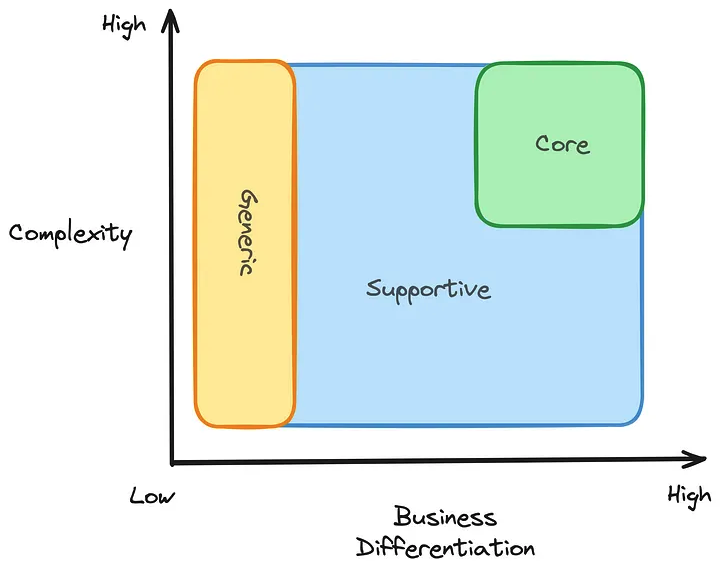
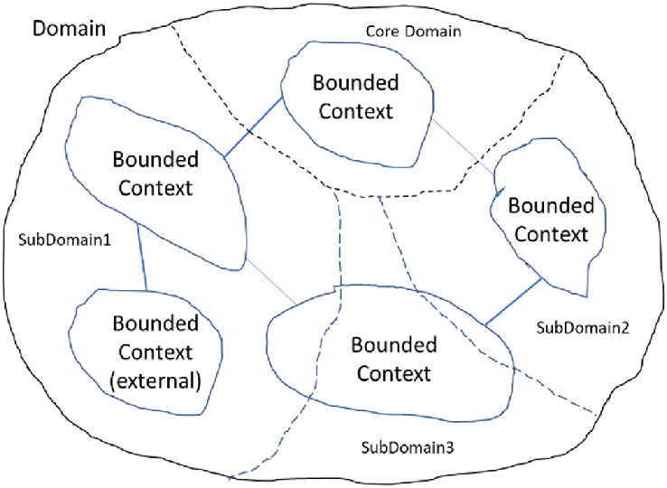
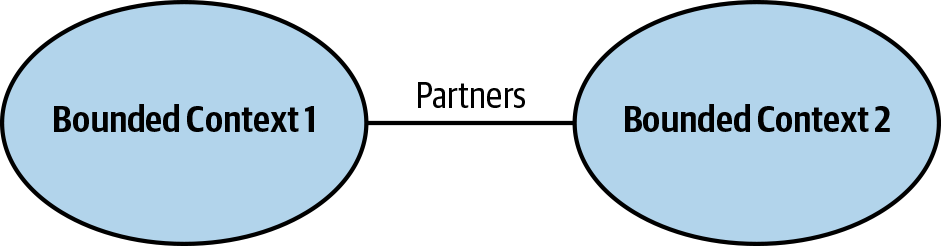
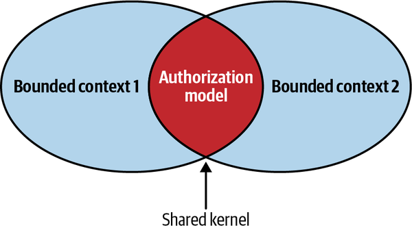
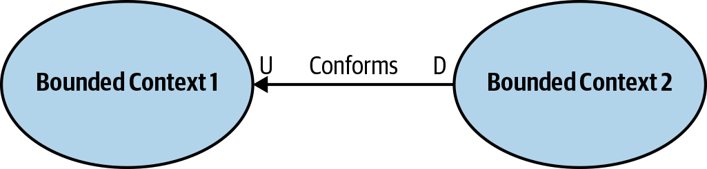
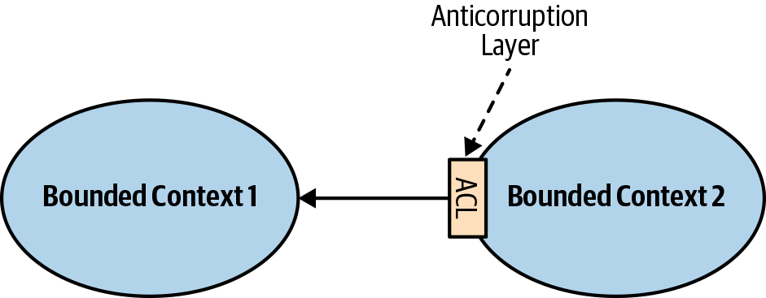
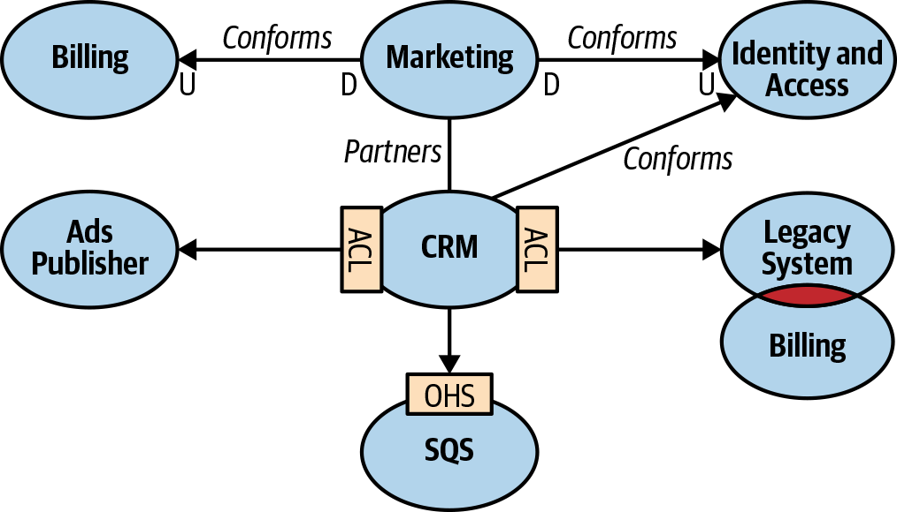

# DDD-Examples

## What is Domain

## What is Subdomain

### what are Subdomain types

- Core subdomain
- Generic subdomain
- Supporting subdomain



> [!TIP]
> Our business is constantly evolving, and as a result, subdomains may change 
> from one type to another. For example, the SSO subdomain, which was initially 
> generic, will be upgraded to a core subdomain to accommodate new specific 
> features.

#### What is the advantages and disadvantages of each subdomains

1. Core subdomain

    - Pros : Competitve advantage, Strategic importance, innovation focus,      direct impact on business.
    - Cons : High complexity, cost, risk of overengineering.

2. Supportive subdomain

    - Pros : Cost-efficient, clear boundaries, easier integration.
    - Cons : Risk of neglect, potential impact on core, limited flexibility.

3. Generic subdomain

    - Pros : Reusability, reduced complexity, best practices.
    - Cons : Dependency risks, lack of differentiation, customization limits.

## Who is Domain expert

## What is the Ubiquitous Language(UL)

## Inconsistency

## Bounded context

## What is the difference between bounded context and subdomain

> [!IMPORTANT]
> Obviously, We discover the Subdomains and design the Bounded context

## Boundaries

**Tips :**

1. A bounded context has to be related to a team.
2. Each team could have some bounded contexts.
3. Every bounded context has separated resources like database
4. Each bounded context must have its Ubiquitous language

    

### Bounded context mapping ([resource](https://www.oreilly.com/library/view/what-is-domain-driven/9781492057802/ch04.html))


1. Cooperation
    - Partnership

        

    - Shared kernel

        

2. Customer-Supplier
    - Conformist

        

    - Anticorruption layer

        

    - Open-Host service
        

3. Separate ways

##### Context map




## Tactical Design

1. Business Logic Patterns
    
    - Transaction script
    - Active record
    - Domain Model

2. Architectural Patterns

    - Layered Architecture
    - Ports & Adapters
    - Command-Query Responsibility Segregation (CQRS)

3. Integration of Bounded Contexts

    - Partnership and Shared Kernel
    - Anticorruption Layer
    - Open-Host Service


## Business Logic Patterns

### Transaction script

### Active record

### Domain Model

#### How we should manage complexity

#### Building Blocks

1. **Value object :** It's Immutable.
    
> [!TIP]
> If a value of object has changed, we must initial a new instance.

    ```c#
    public class Color
    {
        public int Red {get;set;}
        public int Green {get;set;}
        public int Blue {get;set;}

        public Color (int red,int green,int blue)
        {
            Red = red;
            Green = green;
            Blue = blue;
        }

        public Color Mix (Color color)
        {
            return new Color(Red + color.red,
                             Green + color.green,
                             Blue + color.blue);
        }
    }
    ```

2. **Aggregate :**

3. **Domain events :**

4. **Domain sevice :**

#### Save and restore the state of Aggregation

1. State base

In this model, we have just the last state or current statement

2. Event base

According to the model, we have some beneficial achievements that we can use like 

+ Temporal query
+ Projection
+ Snapshot


## Architectural Patterns

### Layered Architecture

#### Presentation
#### Application service
#### Business logic
#### Data access

### Ports & Adapters

### Command-Query Responsibility Segregation (CQRS)


## Integration of Bounded Contexts

### Partnership and Shared Kernel
### Anticorruption Layer
### Open-Host Service